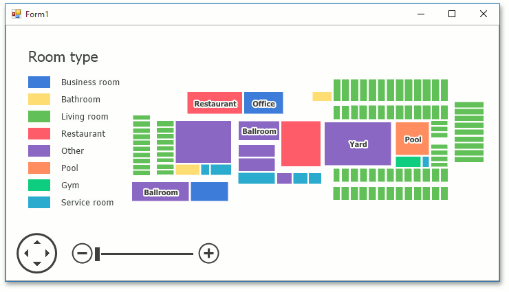

<!-- default badges list -->

<!-- default badges end -->

# Map for WinForms - Getting Started Lesson 2 - Create a Vector Cartesian Map

This repository contains the mapping application project that you get after completing [Lesson 2 - Load a Vector Cartesian Map](https://docs.devexpress.com/WindowsForms/17684/controls-and-libraries/map-control/getting-started/lesson-2-load-a-vector-cartesian-map) tutorial.

## Files to Review

* [Form1.cs](./CS/WinForms_MapControl_Lesson2/Form1.Designer.cs) (VB: [Form1.vb](./VB/WinForms_MapControl_Lesson2/Form1.Designer.vb))

## Documentation

* [Lesson 2 - Load a Vector Cartesian Map](https://docs.devexpress.com/WindowsForms/17684/controls-and-libraries/map-control/getting-started/lesson-2-load-a-vector-cartesian-map)

## More Examples

* [Display Callouts on a Map](https://github.com/DevExpress-Examples/winforms-map-show-callouts)
* [Create Different Map Shapes](https://github.com/DevExpress-Examples/winforms-map-create-different-map-shapes)
* [Create a Choropleth Map Based on Shapes Loaded From a Shapefile](https://github.com/DevExpress-Examples/winforms-map-create-choropleth-map-based-on-shapefile)
* [Create Map Items Based on Data From an XML File](https://github.com/DevExpress-Examples/winforms-map-bind-to-xml-data)
* [Load SVG file Content to the Map Control](https://github.com/DevExpress-Examples/winforms-map-load-svg-file-data)
* [Provide Vector Items From WKT Manually](https://github.com/DevExpress-Examples/how-to-manually-provide-vector-items-from-wkt-t222638)
* [Add MapPie Items to the Map Manually](https://github.com/DevExpress-Examples/how-to-manually-add-mappie-items-to-the-map-t116241)
* [Load data from a SQL geometry data source](https://github.com/DevExpress-Examples/how-to-load-data-from-a-sql-geometry-data-source-t175898)
* [Add MapBubble Items to the Map Manually](https://github.com/DevExpress-Examples/how-to-manually-add-mapbubble-items-to-the-map-t116230)
* [Load Data From a Shapefile](https://github.com/DevExpress-Examples/how-to-load-data-from-a-shapefile-t155190)
* [Load Data From a KML File](https://github.com/DevExpress-Examples/how-to-load-data-from-a-kml-file-t140303)
<!-- feedback -->
## Does this example address your development requirements/objectives?

 

(you will be redirected to DevExpress.com to submit your response)
<!-- feedback end -->
